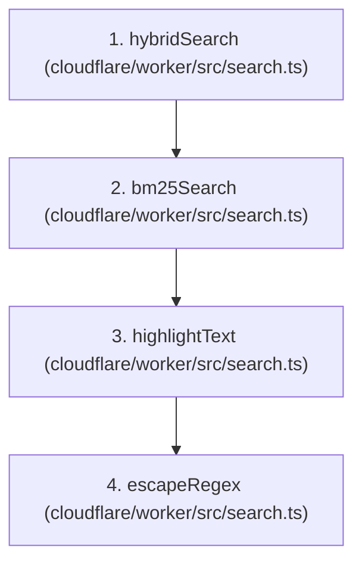
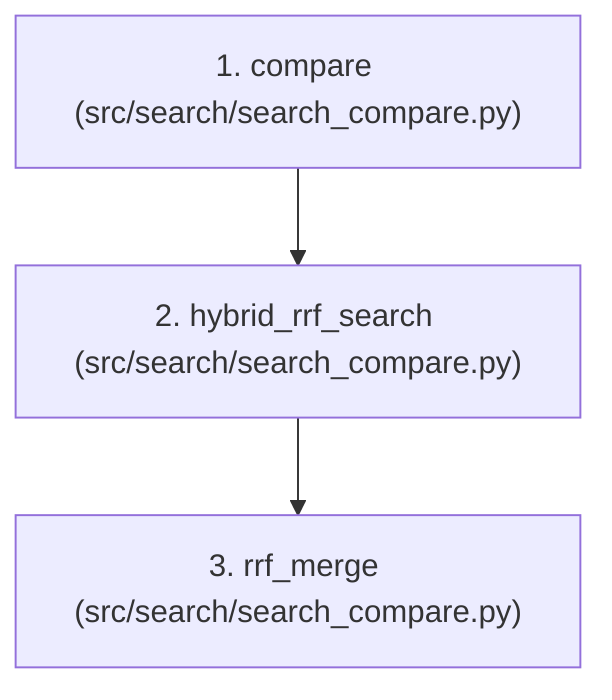
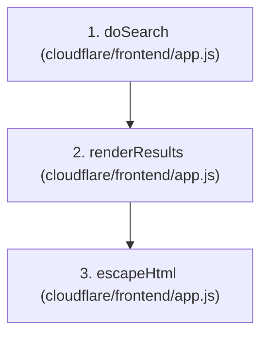

# GitNexus Code Review: Academic Paper Hybrid Search System

This code review analyzes the architecture, code quality, execution flows, and potential vulnerabilities of the **Academic Paper Hybrid Search System (Big-Data)**. The assessment leverages structural insight provided by the GitNexus knowledge graph combined with deep code-level inspections.

---

## 1. Codebase Overview (GitNexus Graph Statistics)

According to GitNexus, the project currently consists of:
*   **Files**: 91 files
*   **Symbols**: 840 symbols (functions, classes, interfaces, etc.)
*   **Relationships (Edges)**: 991 edges
*   **Functional Areas (Communities)**: 14 distinct communities, including:
    *   `Evaluation` (comm_6, comm_8, comm_5, comm_7, comm_9) — Largest communities, highlighting the focus on benchmarking.
    *   `Frontend` (comm_0) — Cloudflare Pages frontend logic.
    *   `Search` (comm_18, comm_16) — Core query and RRF merging.
    *   `Pipeline` (comm_12, comm_15, comm_14) — Data prep, embedding, indexing.
    *   `Scripts` (comm_3, comm_4) — Cloudflare migrations and helper tasks.
*   **Execution Flows (Processes)**: 8 indexed execution flows.

---

## 2. Key Execution Flows (Processes) Tracing

Using GitNexus to trace execution patterns, we analyzed the three primary query and merging flows:

### A. Serverless API Query Flow (`proc_0_hybridsearch`)
This process defines how hybrid search queries are executed inside the Serverless Cloudflare Worker:

*   **Mechanism**: The Worker executes BM25 search (via D1 SQLite FTS5) and kNN vector search (via Cloudflare Vectorize) in parallel using `Promise.all()`, then applies Reciprocal Rank Fusion (RRF) with $k = 60$ to merge the results before returning them with highlighting.

### B. Python Evaluation Compare Flow (`proc_6_compare`)
This flow runs a side-by-side comparison between search methods locally during benchmarking:

*   **Mechanism**: Compares results returned from pure BM25, pure kNN, and RRF-merged Hybrid search side-by-side, tracking latency differences and result overlaps.

### C. Frontend UI Search Flow (`proc_7_dosearch`)
This process runs on the client-side browser:

*   **Mechanism**: Triggers search requests against the `/api/search` endpoint and dynamically renders the results securely by escaping HTML to prevent Cross-Site Scripting (XSS).

---

## 3. Architectural Strengths

1.  **Memory-Efficient Data Pipeline**:
    *   `index_data_v2.py` uses a streaming bulk generator (`stream_actions` and `helpers.streaming_bulk`) to index records without loading the entire JSONL dataset into RAM. This is crucial for scaling up to the 1.16M dataset.
2.  **Elasticsearch Performance Best Practices**:
    *   During indexing, the system disables Elasticsearch refreshes (`"refresh_interval": "-1"`) and sets replicas to 0, resetting them back to `1s` only after completion. This significantly increases indexing throughput.
3.  **Serverless Hybrid Search Equivalence**:
    *   The deployment architecture on Cloudflare utilizes a D1 SQL database with virtual Full-Text Search (FTS5 using `porter unicode61` stemming) to replace Elasticsearch BM25, and Cloudflare Vectorize to replace Elasticsearch kNN. This allows the system to run cheaply and scale infinitely at the edge, maintaining a symmetric RRF formula.
4.  **Rigorous Quality Metrics**:
    *   `evaluate.py` implements standard academic metrics, including NDCG@10 and Mean Reciprocal Rank (MRR), with clear support for manual ground truth labeling.

---

## 4. Vulnerabilities & Code Quality Issues (With Recommended Fixes)

### 🔴 Critical: SQL Syntax Error / Injection Risk in D1 FTS5
In `cloudflare/worker/src/search.ts` (lines 22-26), the search term is formatted for SQLite FTS5:
```typescript
const ftsQuery = query
  .trim()
  .split(/\s+/)
  .map((w) => `"${w}"`)
  .join(" ");
```
*   **The Issue**: If the user inputs double quotes (e.g. `deep learning "attention"`) or special character inputs, wrapping them blindly in `"${w}"` will produce unbalanced quotes (e.g., `"""attention"""`), causing D1 SQLite to crash with a query parser error.
*   **Recommended Fix**: Sanitize the search terms by stripping double quotes and other special FTS5 operators before compiling the `ftsQuery` string.
    ```typescript
    const sanitized = query.replace(/["*]/g, ""); // Strip quotes and wildcards
    const ftsQuery = sanitized
      .trim()
      .split(/\s+/)
      .map((w) => `"${w}"`)
      .join(" ");
    ```

---

### 🟡 Warning: Low Recall/Filtered Results in Vector Search Post-Filtering
In `cloudflare/worker/src/search.ts` (lines 90-95):
```typescript
const topK = Math.min(size * 2, 50);
const vectorResults = await env.VECTORIZE.query(queryVector, {
  topK,
  returnMetadata: "indexed",
});
```
*   **The Issue**: The system retrieves a maximum of 50 nearest neighbors (`topK`) from Vectorize. It then filters these 50 records in D1 based on `year` and `categories`. If a user filters by a specific year or category, most of the 50 vector results may be discarded, resulting in few or zero results, even if matching records exist further down in the vector database.
*   **Recommended Fix**: 
    1.  Increase the candidate retrieval count (e.g., setting `topK` to `100` when filters are active).
    2.  If Cloudflare Vectorize metadata indexing is mature in your setup, pass metadata filters directly to Vectorize query options.

---

### 🟢 Quality: Manual SQL Interpolation in D1 Migration Script
In `cloudflare/scripts/migrate_to_d1.py` (lines 25-46):
```python
def escape_sql(s):
    if s is None:
        return ""
    return str(s).replace("'", "''")
```
*   **The Issue**: The script formats SQL strings manually using `.replace("'", "''")` for batch insertions. While standard for local offline scripts, if data records contain complex LaTeX mathematical formulas (common in arXiv titles/abstracts), backslashes and special unicode characters might get distorted or trigger syntax issues.
*   **Recommended Fix**: Ensure LaTeX formulas are correctly preserved by reviewing sample abstract insertions.

---

### 🟢 Quality: Hardcoded Database Host
In `src/pipeline/index_data_v2.py` and `src/search/hybrid_search.py`, `ES_URL = "http://localhost:9200"` is hardcoded. It is highly recommended to read this from an environment variable (e.g. `os.getenv("ES_URL", "http://localhost:9200")`) to easily support remote or dockerized runs.

---

## 5. Architectural & Performance Comparison

| Metric / Feature | Local Development (Elasticsearch) | Edge Serverless (Cloudflare Stack) |
| :--- | :--- | :--- |
| **BM25 / Keyword** | Elasticsearch BM25 (Lucene-based) | D1 SQLite FTS5 (`porter unicode61`) |
| **Vector Similarity** | ES kNN Dense Vector (Cosine) | Vectorize Index (Cosine, BGE-small) |
| **Hybrid Merging** | Manual Python RRF ($k=60$) | Manual TypeScript RRF ($k=60$) |
| **Indexing Bottleneck** | Disk I/O & Heap Size | Cloudflare Vectorize Dims Limit (~13k free) |
| **Latency Profile** | ~10-40ms (local machine) | ~50-150ms (Edge routing + AI model inference) |

---
*Review compiled by Antigravity using GitNexus Code Intelligence.*
