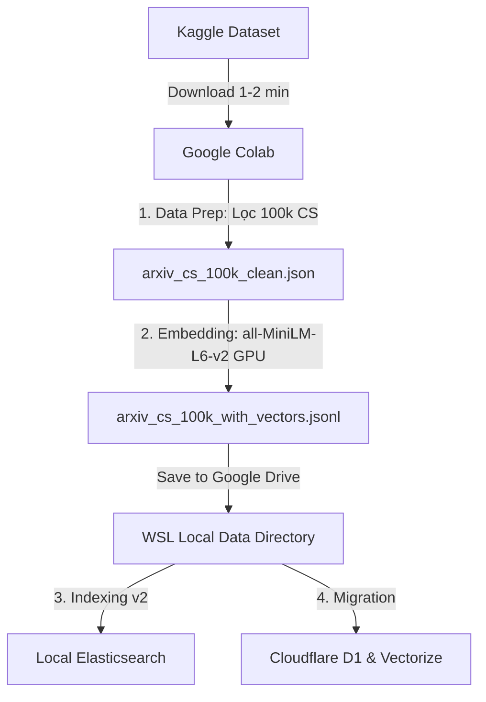

# Implementation Plan - Colab-Based Data Pipeline & Local Indexing

This plan details how to recreate the dataset from scratch using **Google Colab** (leveraging its free GPU and high bandwidth to download from Kaggle), and then index the generated data locally into Elasticsearch and Cloudflare D1/Vectorize.

---

## 1. Goal & Objectives
*   **Recreate Dataset**: Download the full arXiv Kaggle dataset (~3.6 GB) directly in Google Colab.
*   **GPU Acceleration**: Extract 100,000 Computer Science papers and generate 384-dimensional dense vectors using Colab's Nvidia T4 GPU (accelerates embedding from hours to ~5-10 minutes).
*   **Local Indexing**: Download the generated vector dataset back to WSL, index into local Elasticsearch, and deploy to Cloudflare Serverless D1/Vectorize.

---

## 2. Proposed Changes & Steps

The pipeline is split between Google Colab (high performance processing) and your local WSL environment (indexing & search testing).



### Phase A: Google Colab (Data Preparation & Embedding)
*   **Guide Available**: Follow the step-by-step notebook setup written in [colab_pipeline_guide.md](file:///colab_pipeline_guide.md) in your project root.
*   **Kaggle API Integration**: Uses Kaggle API directly in Colab to download the ~3.6 GB raw ZIP file in under 2 minutes.
*   **GPU Batching**: Sets `BATCH_SIZE = 512` in Colab's CUDA device, completing the 100k embeddings in roughly 10 minutes.
*   **Google Drive Storage**: Persists the final `.jsonl` directly in Google Drive to prevent progress loss from random disconnects.

### Phase B: Local WSL (Indexing & Verification)
1.  **Download the result**: Copy the generated `arxiv_cs_100k_with_vectors.jsonl` from your Google Drive into the local project directory under `data/`.
2.  **Verify local Elasticsearch**:
    Ensure the Elasticsearch Docker container is up:
    ```bash
    wsl docker compose up -d
    ```
3.  **Run local indexing**:
    Index the 100k papers with vectors into Elasticsearch:
    ```bash
    wsl python3 src/pipeline/index_data_v2.py --input data/arxiv_cs_100k_with_vectors.jsonl
    ```
4.  **Deploy a subset (up to 12k vectors) to Cloudflare**:
    *   Deploy SQL data to D1:
        ```bash
        wsl python3 cloudflare/scripts/migrate_to_d1.py --input data/arxiv_cs_100k_with_vectors.jsonl
        ```
    *   Deploy vectors to Cloudflare Vectorize:
        ```bash
        wsl python3 cloudflare/scripts/migrate_to_vectorize.py --input data/arxiv_cs_100k_with_vectors.jsonl --max-vectors 12000
        ```

---

## 3. Verification Plan

### Automated Tests
1.  **Check Document Count**:
    Verify that Elasticsearch contains exactly 100,000 documents:
    ```bash
    wsl curl -s http://localhost:9200/arxiv_papers_v2/_count
    ```
2.  **Evaluate Latency & Metrics**:
    Run evaluation benchmark using the real 100k index:
    ```bash
    wsl python3 src/evaluation/evaluate.py --index arxiv_papers_v2
    ```

### Manual Verification
1.  Open the web browser UI and perform queries.
2.  Verify that search results return a rich list of academic papers (more than 3), and check that category filter (e.g. `cs.AI`, `cs.CV`) and year filter function correctly.
